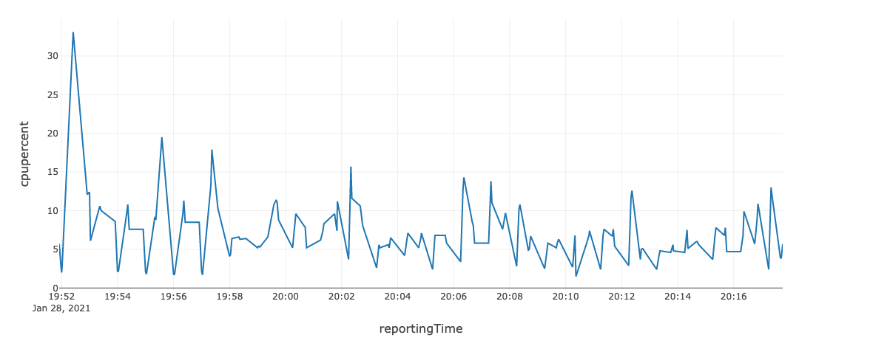
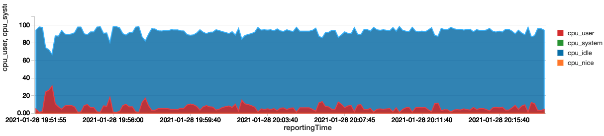
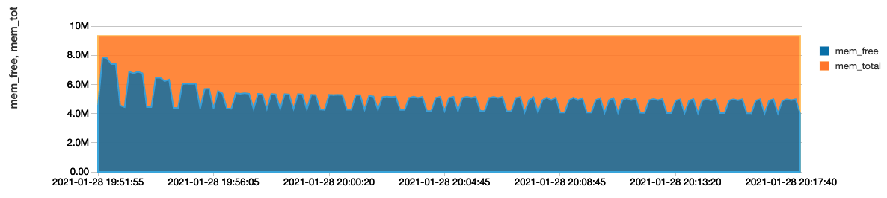

# GangliaExport

This package provides an alternative way to monitor Databricks cluster utilization using Ganglia Web Service on the driver node of each cluster.
The Ganglia metrics can be exported to any Spark datasource format which can be used to analyze cluster usage.

* Metrics can are saved in low cost cloud storage in any Spark format and use any Spark tools like SQL Analytics to monitor performance 
* No other monitoring dependencies which reduces complexity
* Job optimization for automated job clusters

See this [link](https://stackoverflow.com/questions/14557546/is-there-a-api-for-ganglia) for info on the Ganglia api service and xml schema.

Other options to monitor cluster utilization:
* Monitor Ganglia while a job is running or look at Ganglia snapshots in each cluster manually
* Install init scripts to send metrics to Datadog or Log Analytics as noted in [Manage Clusters](https://docs.databricks.com/clusters/clusters-manage.html#monitor-performance)

##Support

| Spark Version | Scala Version | Supported |
| ----- | ---- | ----- |
| Spark 2.x | 2.11 | yes |
| Spark 3.x | 2.12 | yes |

Python support is TBD

## Build

Package
```bash
sbt +package
```
Uber jar
```bash
sbt +assembly
```
Test
```bash
sbt +test
```

## Usage
Load the ganglia export lib into the ```all purpose cluster``` or add as a dependency lib in your automated job
Add the following code to your Spark application:
```scala
import com.databricks.gangliaexport.GangliaExport
val f = GangliaExport.exportMetrics(spark,"delta", Map.empty[String,String],"/tmp/howard.wong@databricks.com/gangliametricstest", 30)
//...

f.cancel(true) 
```
Or
Collect as DataFrame and save:
```scala
val gc = new GangliaClient(gUrl)
var df = GangliaExport.collectMetrics(spark, gc)
df.write.format("csv").partitionBy("reportingDate").mode("append").save("/tmp/testexport")
```

Read Metrics:
```scala
val metrics = spark.read.format("delta").load("/tmp/howard.wong@databricks.com/gangliametricstest")
```
Schema:
```text
root
 |-- clusterName: string (nullable = true)
 |-- clusterId: string (nullable = true)
 |-- hostName: string (nullable = true)
 |-- hostIp: string (nullable = true)
 |-- reportingTime: long (nullable = true)
 |-- metricName: string (nullable = true)
 |-- metricType: string (nullable = true)
 |-- metricUnits: string (nullable = true)
 |-- metricVal: double (nullable = true)
 |-- reportingDate: date (nullable = true)
```

### Sample Queries
Create a temporary view table
```scala
val metrics = spark.read.format("delta").load("/tmp/howard.wong@databricks.com/gangliametricstest")
metrics.createOrReplaceTempView("metrics")
```
CPU Load
```roomsql
%sql
select
  from_unixtime(reportingTime) as reportingTime,
  metricName,
  (100 - metricVal) as cpupercent
from
  metrics
where
  metricName = "cpu_idle"
  and clusterName = 'exporttest'
order by
  reportingTime
```

CPU Usages
```roomsql
%sql
select
  *
from
  (
    select
      from_unixtime(reportingTime) as reportingTime,
      clusterName,
      metricName,
      metricVal
    from
      metrics
    where
      metricName like 'cpu%'
      and metricUnits = '%'
      and clusterName = 'exporttest'
      and reportingTime BETWEEN DATE '2020-01-01' AND DATE '2021-01-31'
  ) pivot (
    avg(metricVal) for metricName in (
      'cpu_idle' cpu_idle,
      'cpu_system' cpu_system,
      'cpu_user' cpu_user,
      'cpu_nice' cpu_nice
    )
  )
order by
  reportingTime
```


Memory Usage
```roomsql
%sql
select
  *
from
  (
    select
      from_unixtime(reportingTime) as reportingTime,
      clusterName,
      metricName,
      metricVal
    from
      metrics
    where
      metricName like 'cpu%'
      and metricUnits = '%'
      and clusterName = 'exporttest'
      and reportingTime BETWEEN DATE '2020-01-01' AND DATE '2021-01-31'
  ) pivot (
    avg(metricVal) for metricName in (
      'cpu_idle' cpu_idle,
      'cpu_system' cpu_system,
      'cpu_user' cpu_user,
      'cpu_nice' cpu_nice
    )
  )
order by
  reportingTime
```
